# Práctica 1 - Entrada/Salida utilizando interrupciones con lenguaje C
---

En esta primera práctica, se implementa un conjunto de funciones (en lenguaje C) relacionada con la E/S mediante interrupciones sowftware (control del crusor, gestión de colores en pantalla...). Todas estas funciones, se pueden probar en [el fichero principal](/ficheros/p1.c), donde se permite ver el funcionamente de estas de manera interactiva, usando una estructura `switch`.       
    
Los ficheros se dividen en aquellos de naturaleza obligatoria (requisitos mínimos) cuya implementación se encuentra en [p1.c](/ficheros/p1.c) y los requisitos opcionales, en [p1_op.c](/ficheros/p1_op.c). Las especificaciones y cabeceras de todas estas funciones se encuentran en el fichero [p1.h](/ficheros/p1.h).        

---
## Requisitos mínimos
1.**`gotoxy()`**: Coloca el cursor en una posición determinada.        

  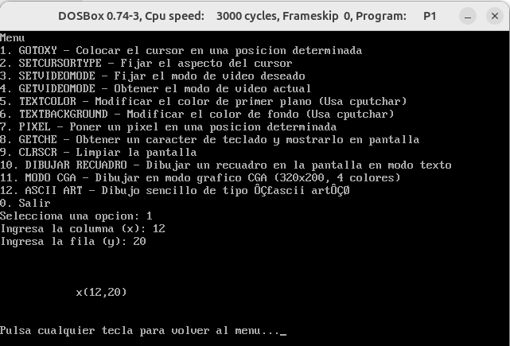

        

2. **`setcursortype()`**: Fija el aspecto del cursor, debe admitir tres valores: INVISIBLE, NORMAL y GRUESO.        

  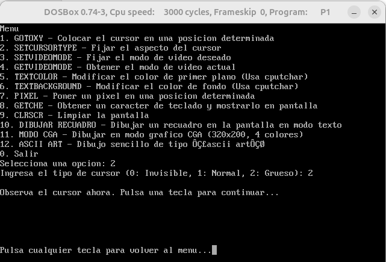

3. **`setvideomode()`**: Fija el modo de video deseado.

  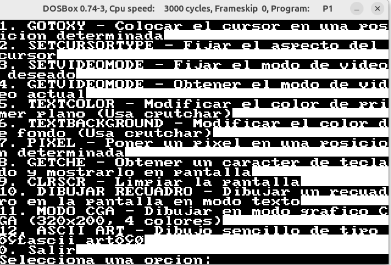

        

4. **`getvideomode()`**: Obtiene el modo de video actual.        

  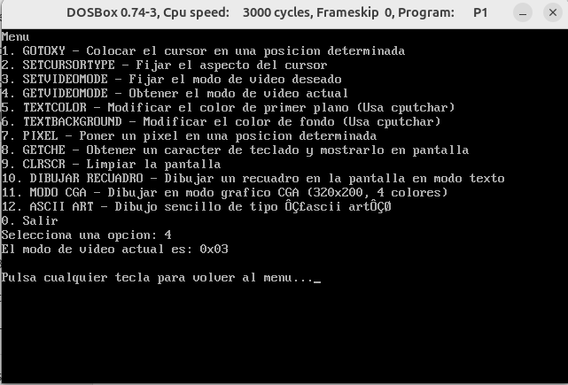

   
5. **`textcolor()`**: Modifica el color de primer plano con que se mostrarán los caracteres.        

  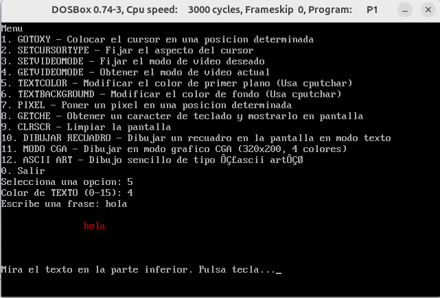

   
6. **`textbackground()`**: Modifica el color de fondo con que se mostrarán los caracteres.

  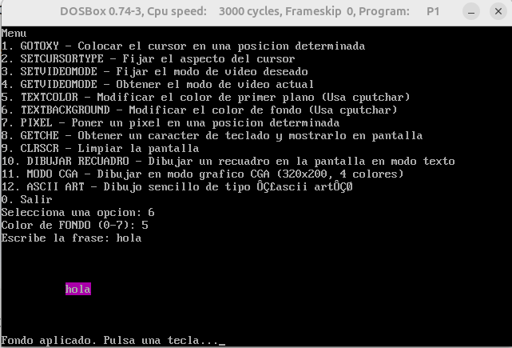

7. **`clrscr()`**: Borra toda la pantalla.

  
  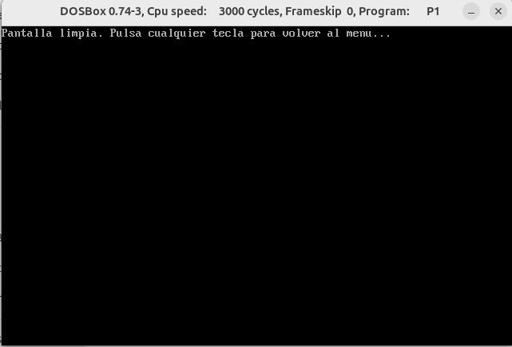

8. **`cputchar()`**: Escribe un carácter en pantalla con el color indicado actualmente.
Esta función se usa como complementaria en varias de las funciones. Para comprobarlo se recomienda visitar el código fuente [p1.h](/p1.h).

9. **`getche()`**: Obtiene un carácter de teclado y lo muestra en pantalla.        

  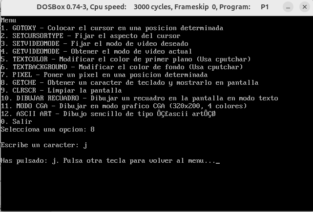

10. **`pixel()`**: Dibujar un pixel en modo gráfico (la función recibirá la coordinada x,y y el color del punto.        

  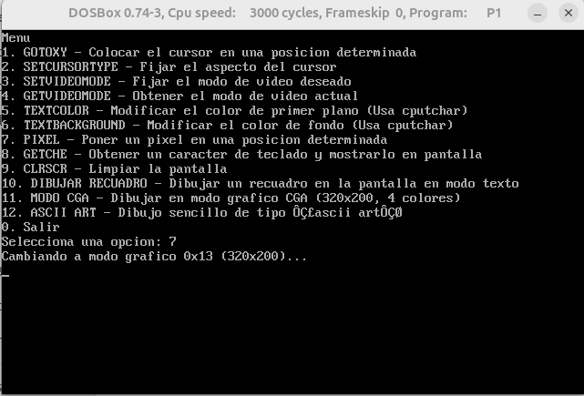
  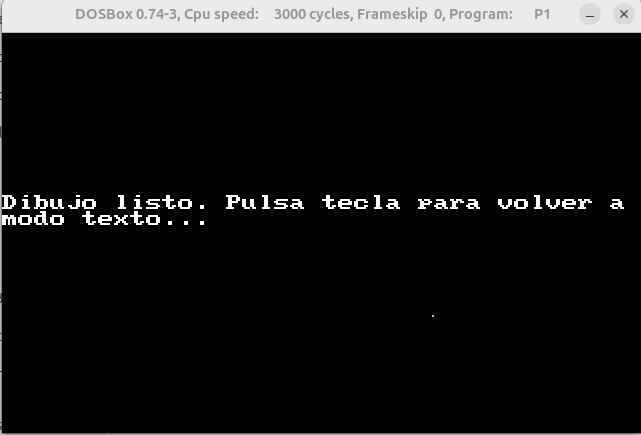

---
## Requisitos ampliados
1. **`dibujarRecuadro()`**: Dibujar un recuadro en la pantalla en modo texto.        

  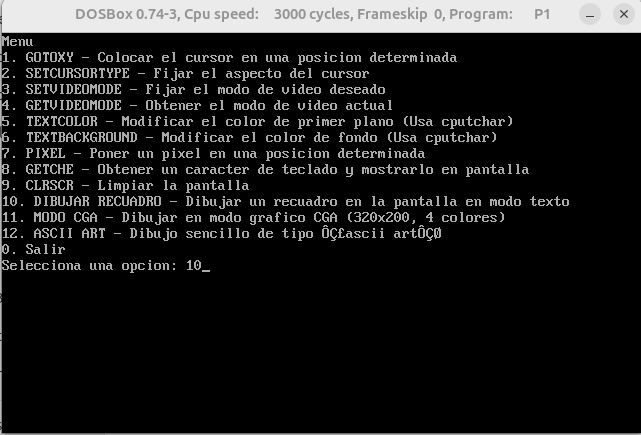
  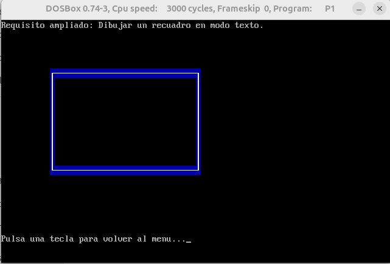

2. **`modoCGA()`**: Establecer modo gráfico CGA (modo=4) para crear dibujos.        

  
  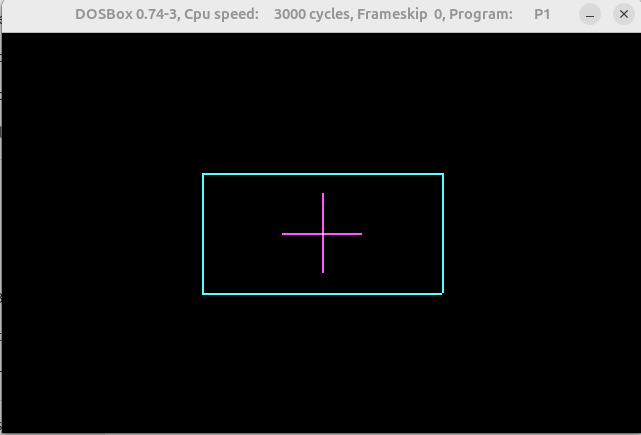

3. **`asciiArt()`**: Dibujo sencillo de tipo “ascii art”.       

  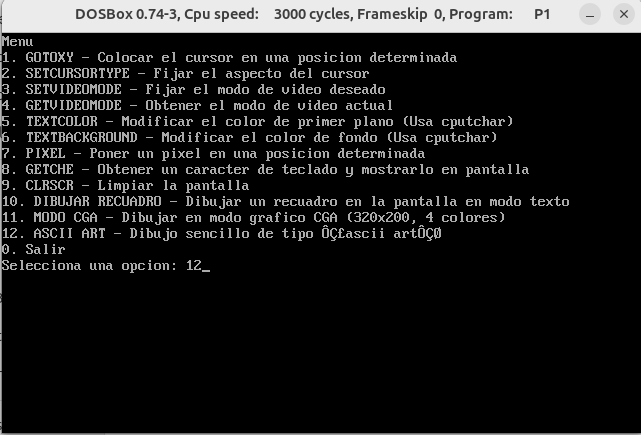
  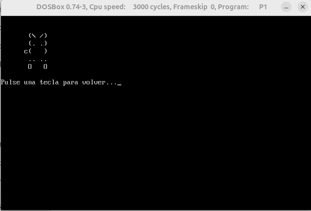

