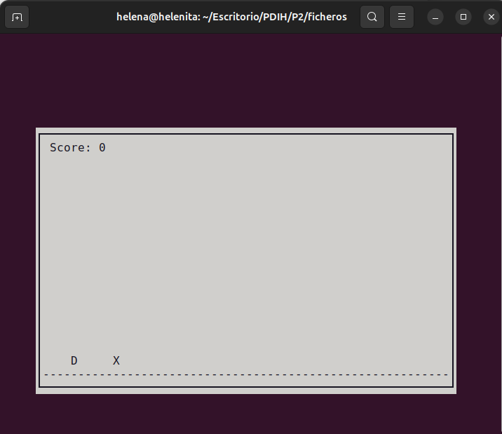
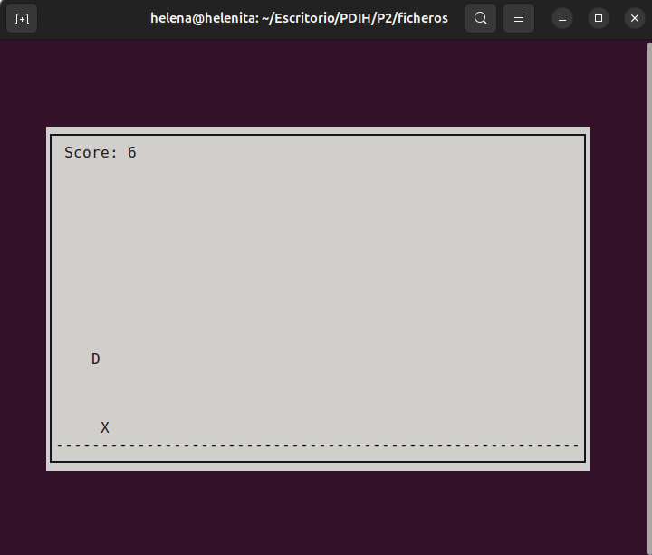
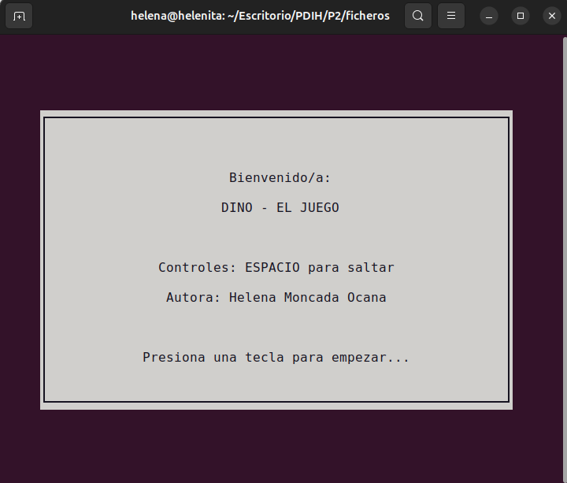
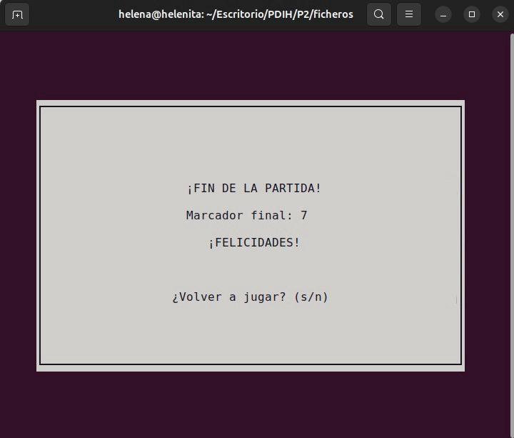

# Práctica 2 - Uso de bibliotecas de programación de interfaces de usuario en modo texto
---
El objetivo principal de esta segunda práctica es profundizar en el diseño y desarrollo de interfaces de usuario en modo texto usando la librería `ncurses` en un entorno de programación C.		

Para ello, hemos probado varios ejemplos propuestos por el profesor. Además, hemos implementado un juego "libre" usando el recurso ya mencionado, lo que me lleva a presentar el juego `Dino`, que veremos con más detalle a continuación. 

---

## Pruebas con la librería `ncurses`

--- 

## Descripción del juego 
El juego que presentó está basado en el "Chrome Dino Game", adaptando las mecánicas de salto del animal y esquivando obstáculos (cáctus).		 

Los elementos del juego son sencillos, cuenta con una ventana principal central donde se lleva a cabo la partida.
* Dinosaurio, elemento principal que debe "esquivar" obstáculos. Se representa con una `D`
* Obstáculos, resperesentados con una `X`
* Puntuación (score), fijada en la esquina izquierda de la pantalla de juego. Cada vez que saltemos un obstáculo incrementa en una unidad.		 

Las imagenes de todos los componentes se verán detalladas más adelante. 

---

## Manual de Usuario y Compilación 
El mecanismo del juego "Dino" es muy sencillo. Para poder ponerlo a funcionar, hay varios requisitos previos que debemos tener en cuenta. 		

### Requisitos del Sistema 
Necesitamos contar con un entorno basado en Linux y tener instaladaa laa biblioteca de desarrollo de `ncurses`. En caso de no disponer de ella, la instalamos sencillamente. En mi caso, que trabajo con Ubuntu (y para cualquier distribución de Debian) usé el siguiente comando: 	
	
`sudo apt-get install libncurses5-dev libncursesw5-dev`		

### Compilación 
Dado que he desarrollado y estructurado el proyecto de forma modular, debemos compilar todos los archivos fuente de manera conjunta, enlazando además la librería de `ncurses`. Dentro de la carpeta raíz del proyecto debemos escribir:		
`gcc main.c p2-dino.c p2-dino_op.c -o p2-dino -lncurses`		
 
* [main.c](ficheros/main.c) - Archivo fuente donde se prueban los métodos. 
* [p2-dino.c](ficheros/p2-dino.c) - Archivo donde encontramos los métodos principales obligatorios. 
* [p2-dino_op.c](ficheros/p2-dino_op.c) - Archivo que contiene las funcionalidades optativas.  
* [p2-dino.h](ficheros/p2-dino.h) - Archivo donde encotramos los prototipos y cabeceras. 		

## Ejecución 
Una vez generado el archivo ejecutable, comenzamos a jugar con el comando: 		

`./p2-dino`		

### Instrucciones de Juego y Controles
El flujo de la aplicación es muy sencillo y se divide en tres fases:		
1. **Pantalla de bienvenida**. Al iniciar, se nos presenta un cuadro blanco central con las instrucciones más básicos y miis datos. Si pulsamos cualquier tecla, comenzaremos la partida. 
2. **Mécanica del juego**. El personaje (D de dinosaurio) se mantiene en el lado izquierdo, mientras que el obstáculo (X) se desplaza continuamente hacia la izquierda. 		
De esta manera, el usuario debe pulsar la `Barra Espaciadora` para ir saltando los obtáculos. Si tocamos un cactus, la partida terminará. 
3. **Puntuación**. Cada obstáculo esquivado suma un punto al marcador.		 
4. **Finalización**. Al producirse una colisión, aparece la pantalla de "Game Over", donde el usuario podrá comenzar una partida nueva (si pulsa `s`) o salir del juego (pulsando `n`), de manera que regresa a la línea de comandos.		

---
Por lo tanto, presento a continuación 

## Requisitos mínimos
1. Programas de ejemplo	- Instalación de ncurses y creación de los programas de ejemplo ofrecidos en el guion de la práctica. 			

2. Juego sencillo - Dino. Implementación de un juego sencillo partiendo del movimiento de la pelotita (juego tipo "pong").	

  
  

---
## Requisitos ampliados
1. Pantalla de Bienvenida - Al iniciar el juego se muestra una pantalla donde se muestran los datos personales y los controles del juego. Tras pulsar una tecla, comienza el juego. 				

  

2. Pantalla Final - Al terminar cada partida, se muestra una pantalla resumen con el marcador (score) final y una felicitación al jugador. Además, se da la opción de volver a jugar o terminar el programa. 

  

		

---
