# Práctica 3 - Experimentación con Arduino
---
El objetivo principal de esta práctica es aprender a usar el entorno de desarrollo de Arduino así como practicar el montaje de circuitos electrónicos. A lo largo de esta memoria se explicarán los pasos seguidos para lograr completar todos los ejercicios, desde la configuración del entorno a la implementación, simulación y validación de problemas. 	

--- 

## Estructura de los ejercicios
Tanto los ejercicios obligatorios como los opcionales siguen la misma estructura, que nos permite cuidar el material, así como aprender la metodologia de diseño de circuitos en una placa de Arduino. Para ello además precisaremos una simulación previa en un software (usando Tinkercad) para una previa implementación hardware. Esta estructura nos garantiza comprender la lógica de control, así como los diferentes componentes electrónicos que usaremos en cada ejercicio y los programas (generados en C++) de entrada/salida. 

* **Configuración del entorno:** Se instala y configura la herramienta de trabajo necesarias para programar el dispositivo Arduino. En mi caso, ya tenía instalado el paquete. En Linux, usé el comando:		
```bash
sudo apt install arduino
sudo apt install arduino-core	
```		
* **Implementación de programas:** Desarrollar programas en `C++`, siendo aplicaciones sencillas que se encargan de gestionar tanto entradas como salidas digitales.	
* **Simulación y validación:** Usar la herramienta [Tinkercad](https://www.tinkercad.com) para verificar que el diseño de nuestros prototipos es correcto antes de implementarlo físicamente y poner en riesgo nuestros componentes.
* **Adaptación de circuitos:** Adaptar los circuitos simulados en Tinkercad en nuestras placas físicas usando el Kit de Arduino.

Todo esto se encuentra recogido en la carpeta individual de cada ejercicio, donde podemos ver todo tipo de detalles del funcionamiento de cada circuito individualmente. Podrás encontrar desde imagenes de la simulación, imagenes reales del montaje en la placa física, hasta videos y el código fuente que hace funcionar el experimento.  
  
---

A continuación, se explicarán todos los ejercicios así como los materiales precisos para replicar los montajes y simulaciones. Se presuponen algunos elementos básicos y comunes para todos los ejercicios (todos pertenecientes al [Arduino Starter Kit](https://robotopia.es/kits-educativos/103-arduino-starter-kit-castellano.html).
**Componentes Básicos:**    
* Placa Arduino - Uno o Mega 2560
* Breadboard Placa de prototipado
* Cable USB para conexión al ordenador
* Jumpers - Cables de conexión macho - macho

## 1. Ejercicios Obligatorios (Requisitos Mínimos)
En esta sección explicaremos dos ejercicios que debemos realizar para cumplir los requisitos más básicos que se solicitane en esta práctica. Con estos, aprenderemos la utilidad y manejo de E/S digitales. 

### Ejercicio 1 - Parpadeo de LED
**Materiales:** 
* Componentes Básicos
* 3 LEDs - Rojo Amarillo y verde
* 3 Resistencias de 220kΩ    

El primer ejercicio consiste en implementar un programa de parpadeo de LED que permita encender y apagar alternativamente tres LEDs de diferentes colores. Para ello, se nos propone una estructura y ciertas referencias para poder llevarlo a cabo. Concretamente, debemos usar las salidas digitales 11, 12 y 13 de Arduino y un intervalo de 1.5 segundos (1500 milisegundos). Los detalles se encuentran en el [código fuente]("img_fich/ej1/ej1.ino").

<p align = "center"> Simulación del ejercicio 1 en Tinkercad.</p>
<p align="center">
  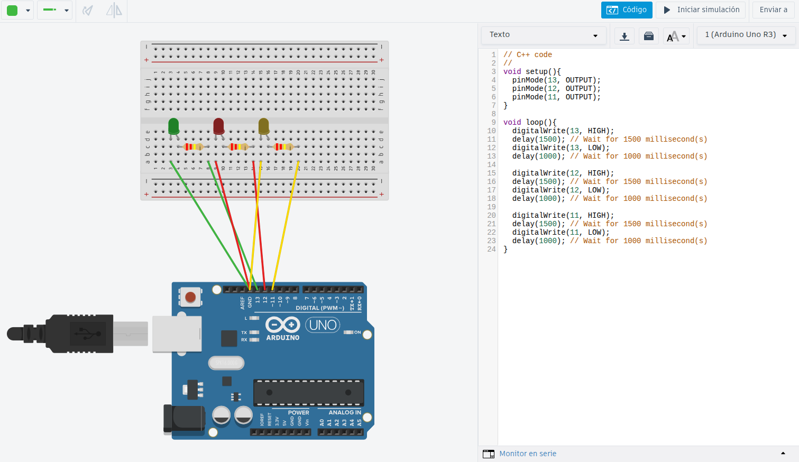
</p>

Una vez realizamos la simulación en la plataforma, así como el código fuente, el trabajo más complejo está hecho. El siguiente paso era realiar el montaje, lo cual podemos apreciar en las fotos a continuación y en el [video]("img_fich/ej1/ej1_video.mp4")  que se encuentra en la misma carpeta. 

<p align="center">
  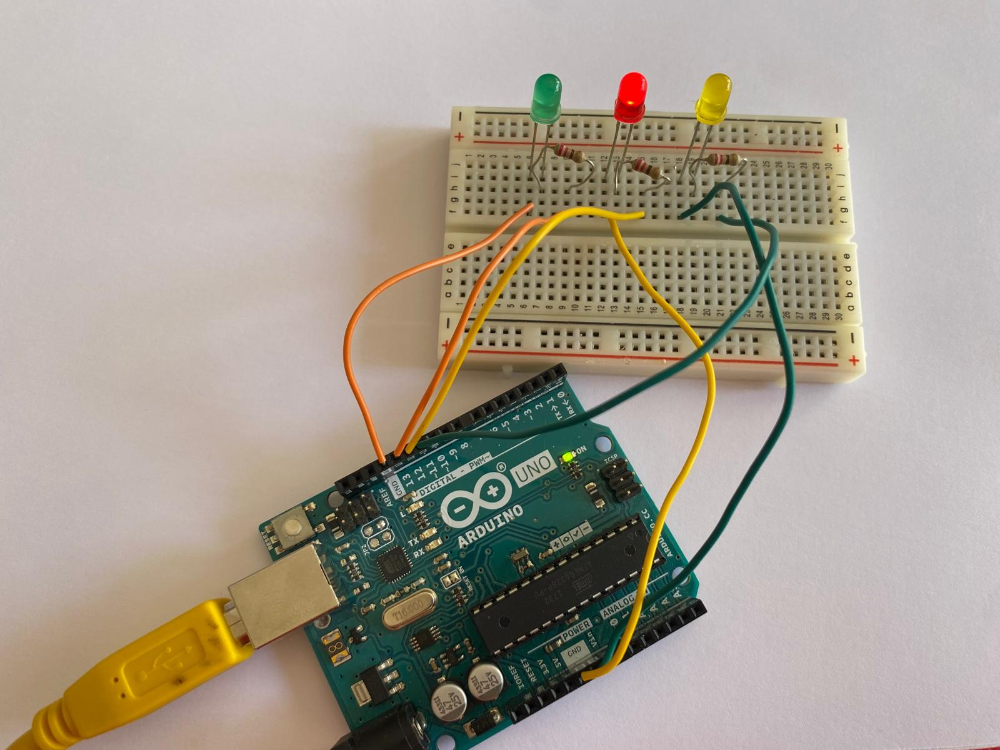
  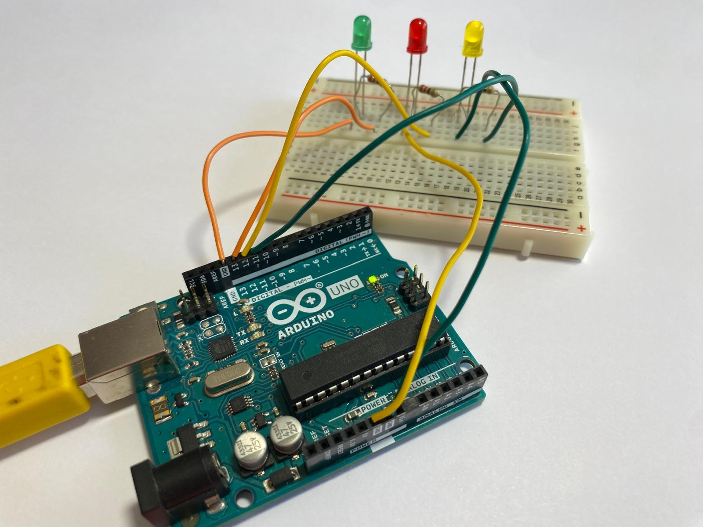
</p>

### Ejercicio 2 - Parpadeo de LEDs con interruptor
**Materiales:** 
* Componentes Básicos
* 3 LEDs - Rojo Amarillo y verde
* 3 Resistencias de 220kΩ
* 1 Pulsador o Interruptor

Este ejercicio es una ampliación del programa anterior en el que se nos solicita introducir una lógica de control basada en un botón o interruptor (salida externa). Para ello, mantenemos la misma estructura y añaidmos un pulsador en la entrada digital 7. Lo que buscamos en este caso es que los LEDs amarillo y verde sigan el mismo funcionamiento que en el apartado 1, mientras que el LED rojo debe permanecer encendido cuando esté el botón pulsado y apagado en el resto de casos. La lógica de este experimento la encontramos en este [enlace]("img_fich/ej2/ej2.ino").

Duplicamos el fichero de Tinkercad anterior, al cual le añadimos un pulsador, y obtenemos el siguiente modelo: 

<p align = "center"> Simulación del ejercicio 2 en Tinkercad.</p>
<p align="center">
  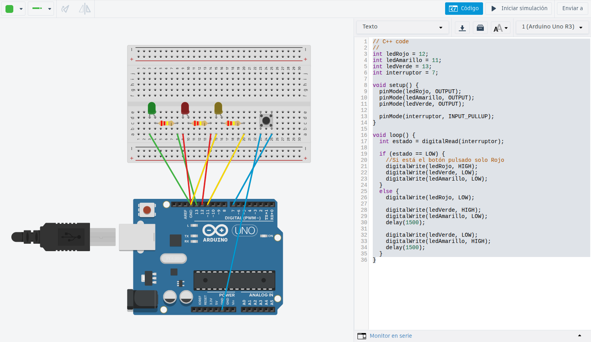
</p>

El montaje en nuestra placa con los diferentes componentes electrónicos (LEDs, resistencia, cables y pulsador, entre otros):
<p align="center">
  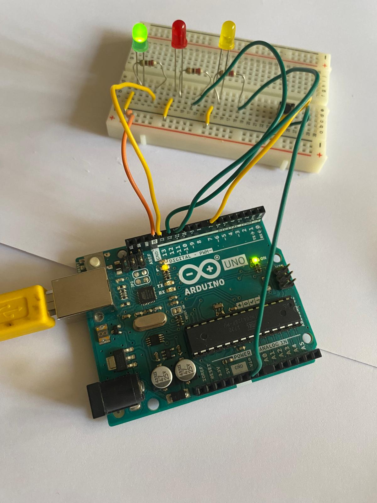
  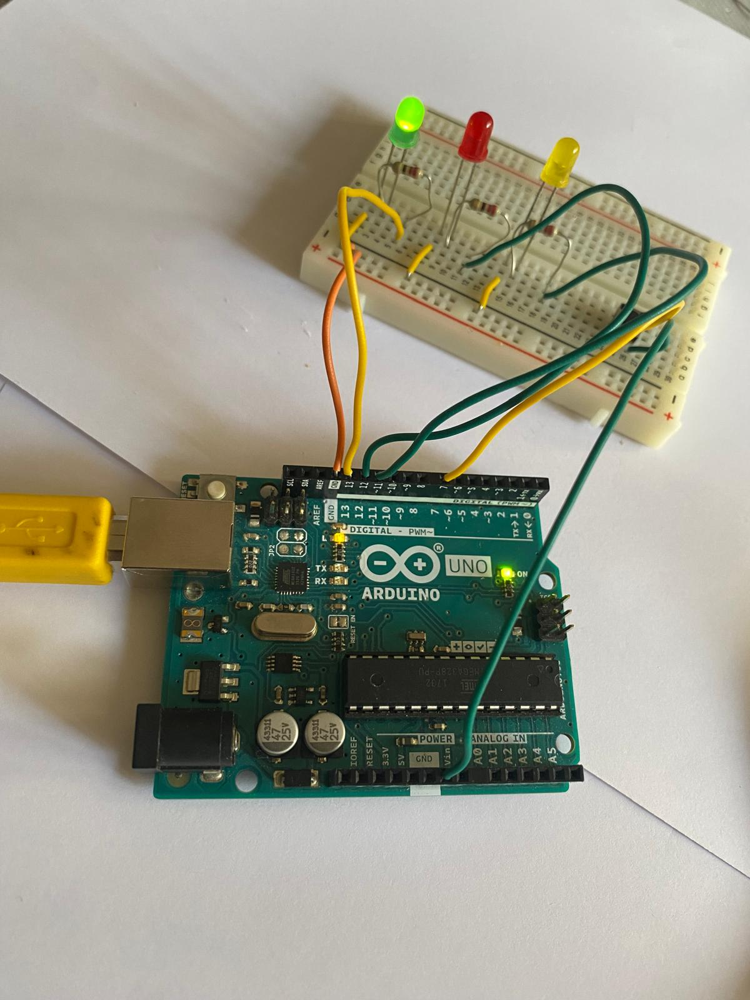
</p>

---

## Ejercicios Opcionales (Requisitos Ampliados)
El comienzo de estos ejercicios requiere la previa consolidación de los conceptos fundamentales que hemos trabajado y explicado en la parte "obligatoria". Ahora, exploraremos capacidades y componentes más avanzados de Arduino. Aumentaremos el nivel de complejidad técnica usando señales binarias y procesando señales de tiempo y control con actuadores mecánicos.  

### Ejercicio 1 - Secuencia de LEDs (_"El coche fantástico"_)
**Materiales:** 
* Componentes Básicos
* 4 LEDs - Preferiblemente del mismo color
* 4 Resistencias de 220kΩ
* 1 Pulsador o Interruptor
  
Para resolver este apartado, debemos programar cuatro LEDs para que se enciendan y apaguen de forma consecutiva (efecto de barrido o ida y vuelta). Este efecto lo podemos ver en uno de los [videos]("https://bit.ly/3Lu7YNz") proporcionado por el profesor. La implementación la podemos consultar en la carpeta ([ej1_op]("https://bit.ly/3Lu7YNz")) asignada. 

<p align = "center"> Simulación del ejercicio opcional 1 en Tinkercad.</p>
<p align="center">
  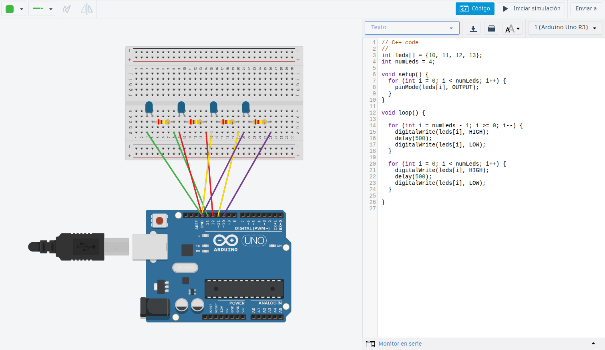
</p>

Podemos ver la estructura y montaje en las siguientes imagenes:
<p align="center">
  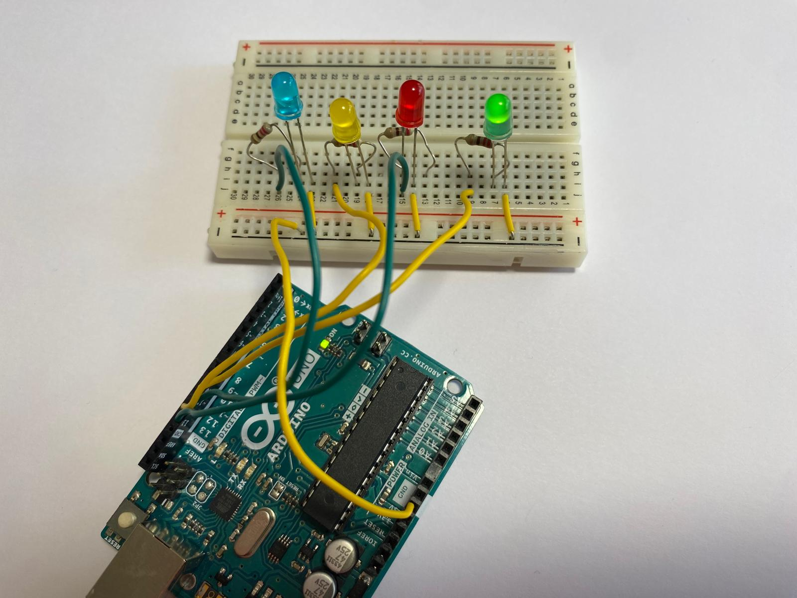
  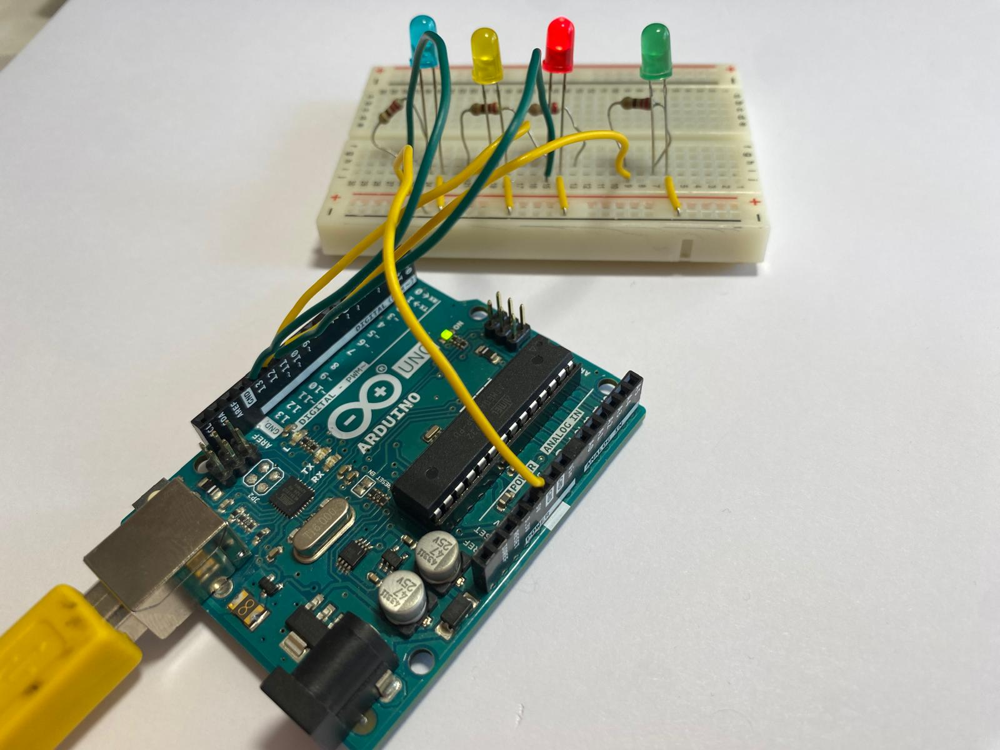
</p>

### Ejercicio 2 - Detector de la distancia a un objeto
**Materiales:** 
* Componentes Básicos
* 1 Sensor de ultrasonidos - HC-SR04
* 4 Buzzer (zumbador)
* 1 Pulsador o Interruptor

Este segundo ejercicio es muy interesante, ya que se basa en crear un sistema que permita mediante un sensor de ultrasonidos medir la distancia física entre el dispositivo y un obstáculo. Para ello, necesitaremos un zumbador (buzzer) que actúe como alerta o alarma acústica. Según la distancia del objeto, el "altavoz" emite un pitido diferente. Mediante la [implementación]("img_fich/ej2_op/ej2_op.ino") nos encargaremos de determinar el tiempo transcurrido para determinar la distancia exacta en centímetros. 

<p align = "center"> Simulación del ejercicio opcional 2 en Tinkercad.</p>
<p align="center">
  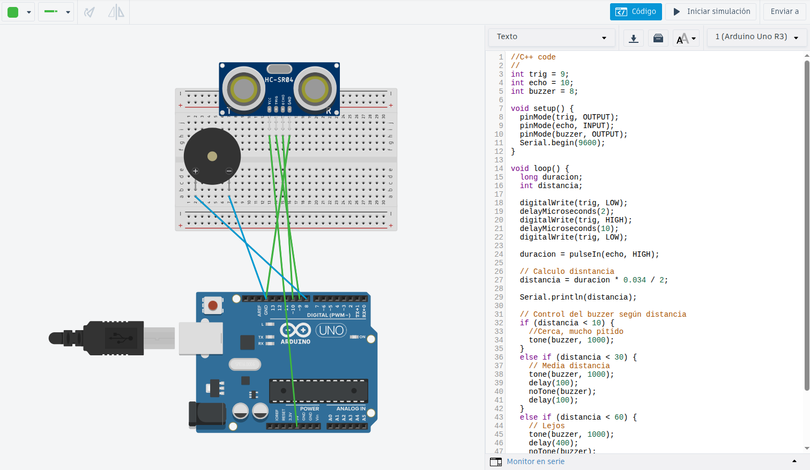
</p>

Para ver cómo sería el montaje físico resulta interesante visualizar las siguientes imágenes, así como visitar el [video de su funcionamiento]("img_fich/ej2_op/ej2_op_video.mp4"): 

<p align="center">
  
  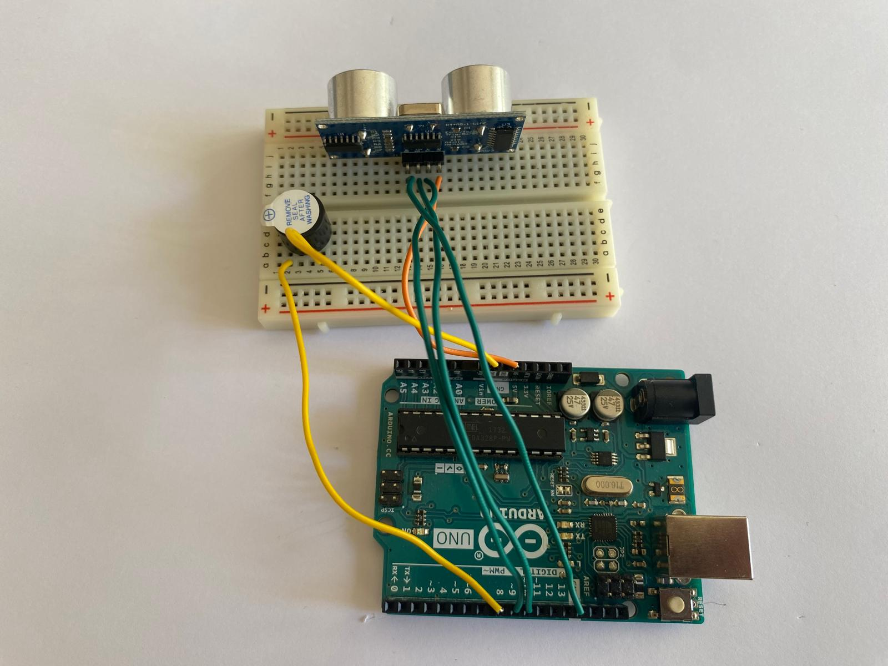
</p>

### Ejercicio 3 - Detector de la cantidad de luz
**Materiales:** 
* Componentes Básicos
* 1 Fotoresistencia (LDR)
* 1 LED 
* 1 Resistencia de 10kΩ
* 1 Resistencia de 220kΩ

Este proyecto consiste en diseñar un circuito que mida la intensidad lumínima de un entorno ajustando automáticamente la respuesta de un LED. Es similar al mecanismo que usan las apantallas de los teléfonos móviles para regular su brillo.    

El programa porcesará el nivel de luz mediante la fotoresistencia y a medida que el entorno oscurezca el LED aumentará su brillo. Para llevarlo a cabo, debemos aprender a configurar las entradas analógicas mapeando los valores para controlar las salidas variables. Esto queda reflejado en el [código]("img_fich/ej3_op/ej3_op_ej3_op.ino") usado para poner en funcionamiento el circuito así como en el [video representación]("img_fich/ej3_op/ej3_op_video.mp4"). 

<p align = "center"> Simulación del ejercicio opcional 3 en Tinkercad.</p>
<p align="center">
  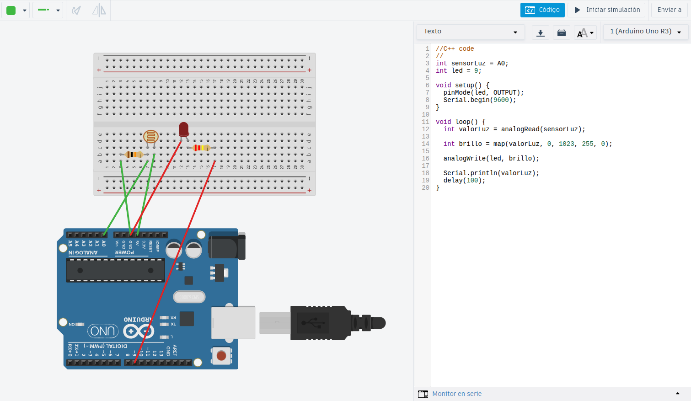
</p>

<p align="center">
  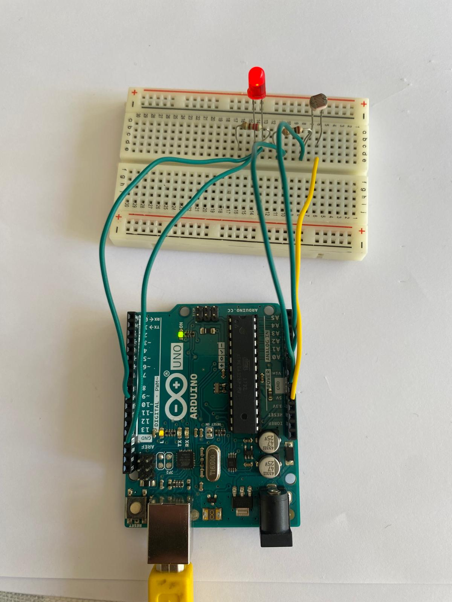
  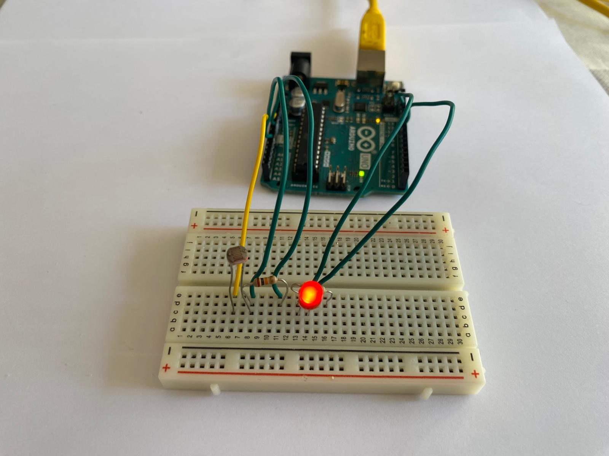
</p>

### Ejercicio 4 - Activación de un motor
**Materiales:** 
* Componentes Básicos
* 1 Pulsador o Interruptor
* 1 Actuador - Motor DC o Servomotor 

Este último ejercicio resulta extremadamente interesante debido a que vemos la interacción de la placa Arduino con elementos mecánicos que requieren una gestión específica de energía o señales de posición, como es el caso de los motores requeridos en este apartado. 

Una vez más, usaremos un pulsador/botón como dispositivo de entrada para activar un actuador físico. Una vez pulsado, el Arduino envia la señal para iniciar el movimiento, que en este caso es mover una pestaña una cantidad determinada de grados. 

Se proponen varios tipos de actuadores como son:
* Servomotor: controla la posición angular (pover una pestaña un número determinado de grados). Es el que yo he usado y podemos ver en las distintas demostraciones a continuación.
* Motor DC: permite un gir continuo (como si fuesen, por ejemplo, las aspas de un ventilador).

En su [código fuente]("img_fich/ej4_op/ej4_op.ino") podemos ver como aprendemos a gestionar comoponentes que a diferencia de los LEDs del resto de ejercicios de esta práctica, suelen requerir alimentación
externa o librerías específicas de Arduino (como por ejemplo `Servo.h`) para funcionar. Consulta el [video demostración]("img_fich/ej4_op/ej4_op_video.mp4").
<p align = "center"> Simulación del ejercicio opcional 4 en Tinkercad.</p>
<p align="center">
  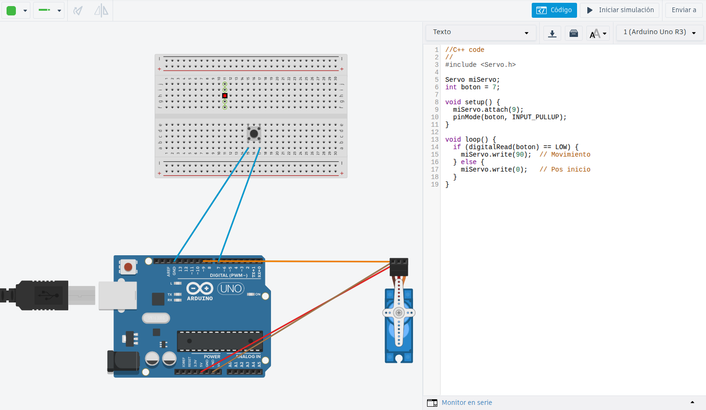
</p>

<p align="center">
  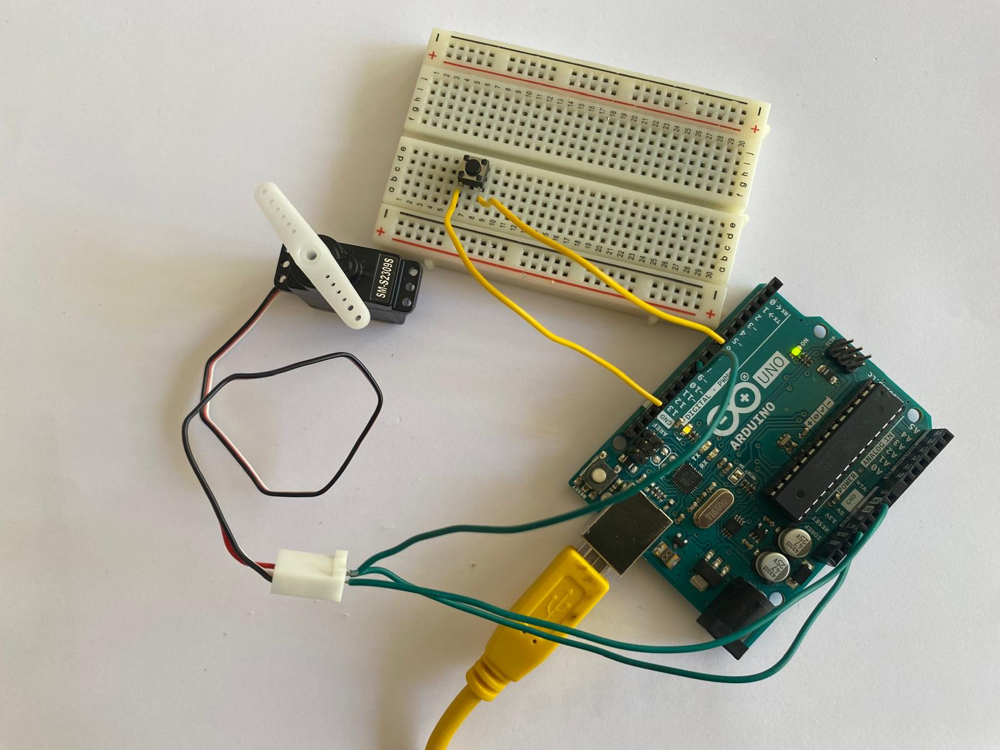
  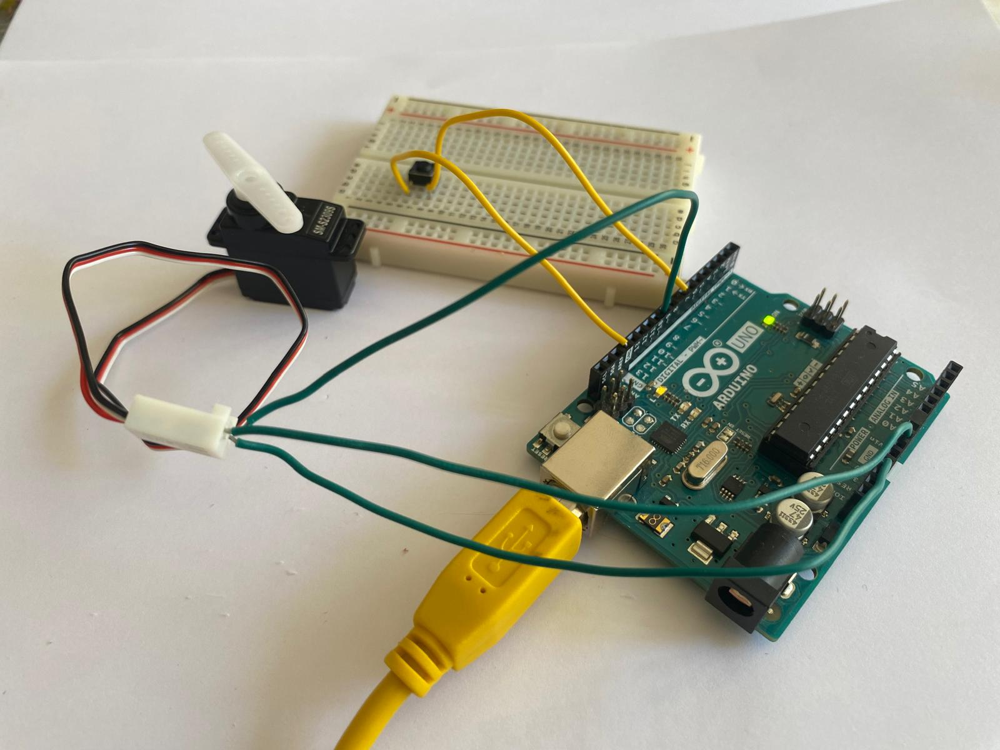
</p>


---
