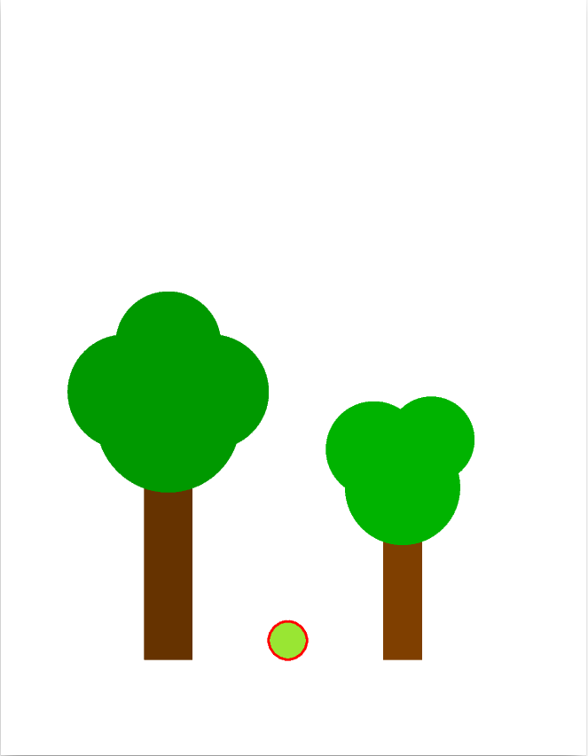
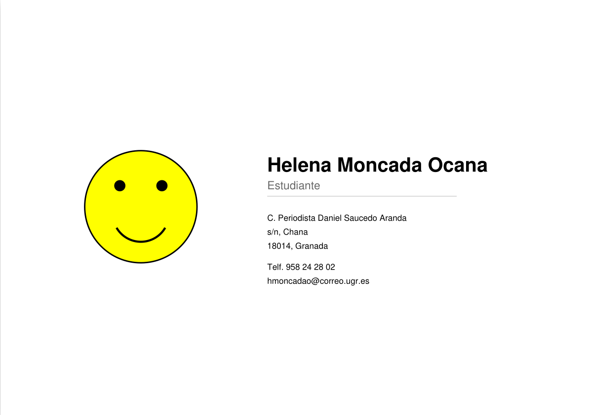
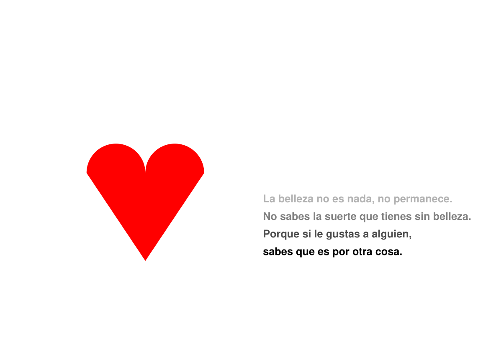
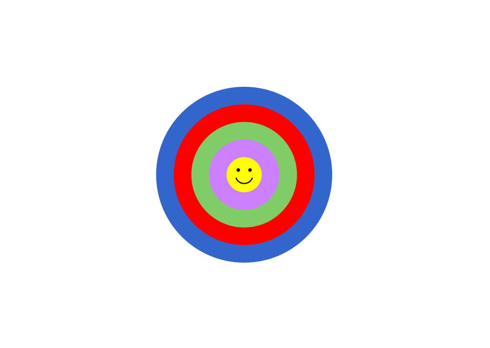
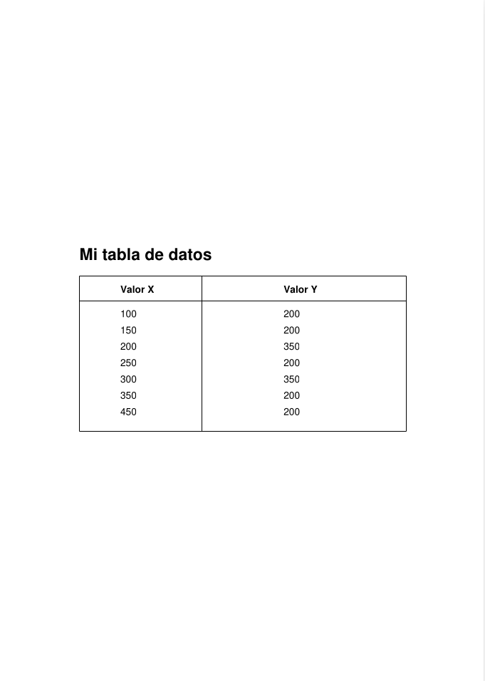
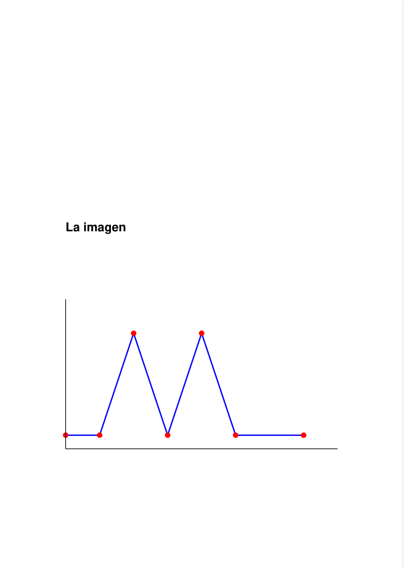

# Práctica 4 - El lenguaje Postscript
---
A lo largo de esta práctica aprenderemos a crear imagenes y documentos usando código. En vez de usar un programa convencional de dibujo se usa el lenguaje `PostScript`permitiendo usar instrucciones que permiten dar instrucciones precisas de donde colocar cada línea, color o texto. Para ello, en la presentación de la práctica se explican los operadores clásicos, así como las caracterísiticas del lenguaje y la estructura de los ficheros. 

--- 

## Ejercicios obligatorios (mínimos)

### Ejercicio 1 - Composición de árboles

En este primer ejercicio el objetivo era familiriarse con la sintaxis básica de PostScript y su sistema de coordenadas. La escena concreta se basa en dos árboles de diferente tamaño y un circulo, compuestas principalmente por figuras geométricas. 

El proceso fue muy sencillo, basado en el montaje y combinación de diferentes piezas. Por un lado, se defin el tronco con rectángulos. Después, se construye sobre estos ñas copas (usando arcos de 360º). 

El [archivo original]("ej1.ps") se encuentra en el directorio de la práctica, así como su conversión a pdf usando el comando `ps2pdf`en la terminal de Ubuntu. 

  

### Ejercicio 2 - Tarjeta de visita

Para resolver este ejercicio vamos a realizar una tarjeta de visita con formato apaisado. El formato se basa en un logo personal diseñado y a su izquierda todos los datos personales. 

En este caso, se configura la página en apaisado, con la línea `<< /PageSize [842 595] >> setpagedevice`. Además, también se usan comandos esenciales para seleccionar tipografía así como ajustar el tamaño quedando un estilo clásico y elegante. 

A continuación, podemos ver en la imagen el resultado final, así como podemos ver el [archivo fuente]("ej2.ps"). 

  

### Ejercicio 3 - Poesía
En este apartado debemos crear un espacio que combina una figura compleja (un corazón) con una poesía con un diseño con un estilo "degradado" usando diferentes intensidades entre gris y negro. El mayor desafío era generar el corazón, ya que al no ser una figura geométrica básica (como por ejemplo un cuadrado o círculo simple). 

Para generar el corazón, no usamos ninguna figura predefinida, sino que hemos tratado de calcular trayeectorias y cerrar un área común. Para ello se usan arcos para los "hombros" y lineas para la punta inferior. 

 

  

---

## Ejercicios opcionales (ampliados)

### Ejercicio 1 - Círculos
En este caso, debeos mostrar una imagen con una sonrisa dentro de circulos concéntricos de diferentes colores. Todo esto dentro de una paǵina apisada. La figura compuesta por círuclos parece una "diana". 

La lógica detrás de este dibujo es muy sencillo, ya que hemos usado arcos de 360º empezando con el círuclo más grnde (el de color azul) y repitiendo el mismo proceso hasta el más pequeño (el amarillo, con un radio de 30). Para añadir colores, se usa el comando `setrbgcolor`. Una vez realizada la "diana", se añade la carita sonriente. 

 

  

### Ejercicio 2 - Tabla y Gráfica
Lo interesante de este último ejercicio fue aprender a generar documentos de más de una página, puesto que los anteriores eran todos de una sola. 

El objetivo era diseñar en la primera página una tabla de datos inventada. En la siguiente página, mostrar una gráfica en forma de cresta, usando el comando `lineto`uniendo las coordenadas para representar picos y rectas. Para marcar los puntos, usamos círuclos rellenos (usando `arc` + `fill`) en cada vértice para resaltar los puntos en color rojo.

  
  

---
