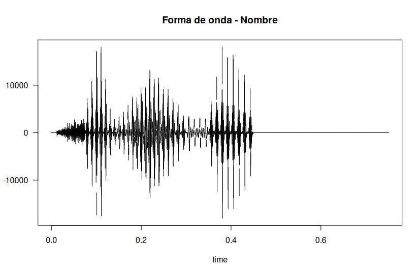
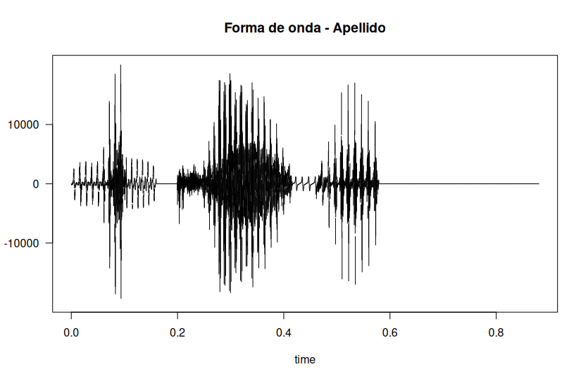
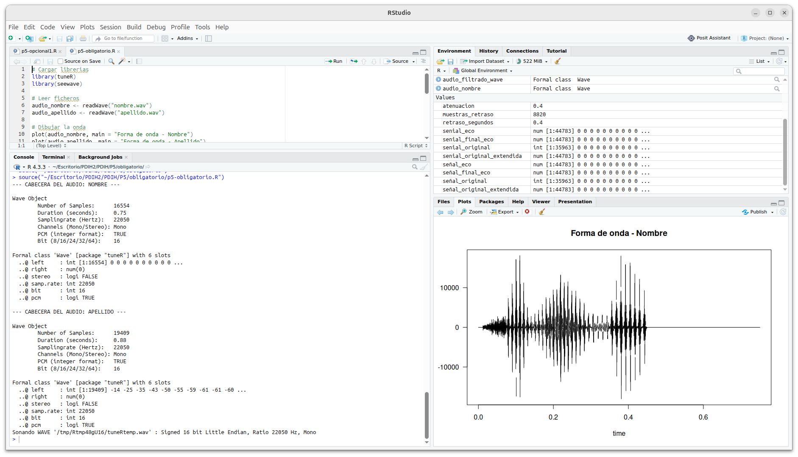
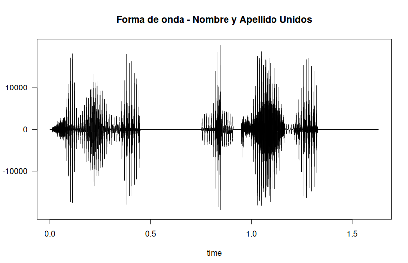
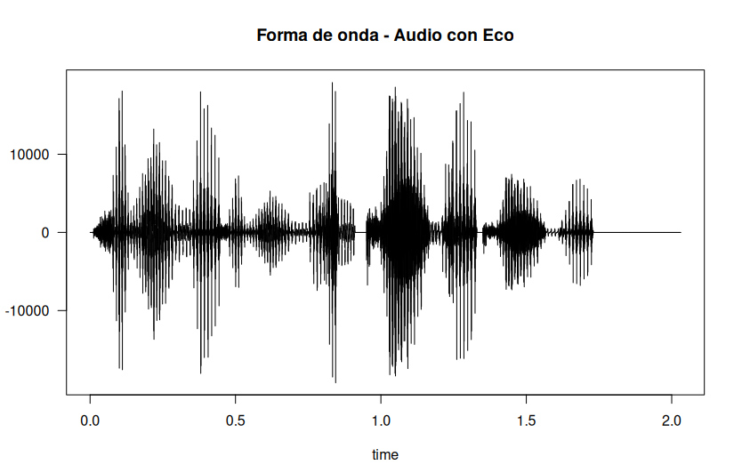
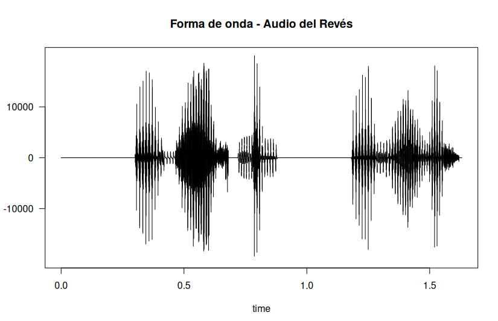

# Práctica 5 - Experimentación con el sistema de salida de sonido
---
En esta práctica, el objetivo es procesar y analizar señales de audio digital, utlizando en mi caso el entorno de R. Usarmelos código sobre los parámetros de ondas sonoras para comprender la estructura de un fichero típico de audio (WAV), aplicando téncicas como el filtrado o efectos como el eco.		

Para trabajar, la opción que me ha resultado más sencilla ha sido RStudio y sus librerías especializadas para trabajar con archivos de audio llamadas `tuneR` y `seewave`, las cuales debemos instalar previamente. 

--- 
## Ejercicios obligatorios (mínimos)

### Ejercicio 1 - Nombre y Apellido

El objetivo del primer ejercicio (el único obligatorio) era familiarizarse con la sintexis básica, en este caso de R, usando los ejemplos de premisas que se presentan en el propio guion de la práctica. De esta manera, aprendemos a manejar archivos de audio y a representarlos. 		

Para ello, creamos `nombre.wav` y `apellido.wav` que contienen dentro "Helena" en el caso de nombre, y "Moncada" en el caso de apellido generados previamente. En mi caso, al usar Linux, utilicé el siguiente comando:

```bash
espeak "Helena" -w helena.wav	
```

El proceso consistía en leer los ficheros con `readWave()` y dibujar la onda de ambos sonidos por separado. 

<p align="center">
  
  
</p>

Además, para resolverlo tenemos que obtener los metadatos e información téncica de cada uno de los ficheros de autio por separado usando `str()`. El estracto concreto con mis salidas se ve en la siguiente imagen, donde podemos ver en la consola a la izquierda los metadatos:

<p align="center">
  
</p>

A continuación, se debe unir ambos sonidos en uno nuevo, usando `bind()`, creando una nueva señal. Una vez almacenada, creamos una nueva onda. Se puede consultar en [basico.wav]("obligatorio/basico.wav"). En este escuchamos "Helena Moncada". 

<p align="center">
  
</p>

---

## Ejercicios opcionales (ampliados)

### Ejercicio 1 - Filtro de frecuencia

Este primer ejercicio opcional consiste en aplicar un filtro de frecuencia sobre `basico.wav` que es el audio combinado, y eliminar las frecuencias entre 10.000Hz y 20.000Hz, usando samos la función `bwfilter()`. A continuación, almacenaremos la señal obtenida como otro fichero WAV llamado [filtrado.wav]("opcional/ej1/filtrado.wav"). 		
	
<p align="center">
  
</p>


### Ejercicio 2 - Efecto de Eco y Reversa

El último ejercicio es el más completo, donde tenemos que aprender a usar vectores numéricos para aplicar efectos algo más complejos a los audios (de nuevo, sobre `basico.wav`). 		

El primer efecto era el eco. La primera versión planteada generaba silencios, por lo que busqué otra manera de realizarlo. La mejor opción fue usar uno de sus canales y sumarle la señal atenuada (`amp`) con un desplazamiento temporal (`d`).		

<p align="center">
  
</p>


El segundo apartado, consistía en darle la vuelta al sonido y almacenarlo con el nombre [alreves.wav]("opcional/ej2/alreves.wav"). En este, se da la vuelta temporalmente, usando `revw()` a la muestra.

<p align="center">
  
</p>

---
