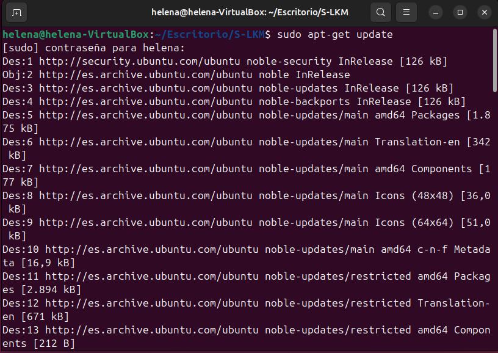
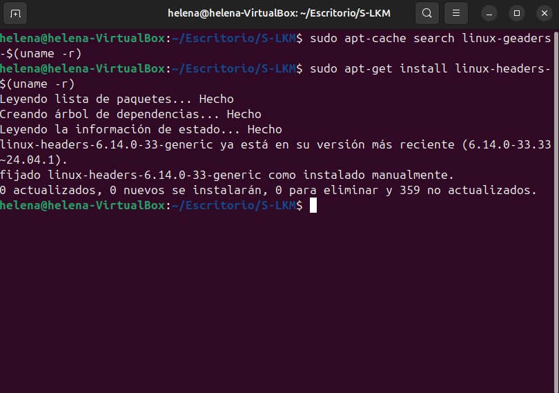
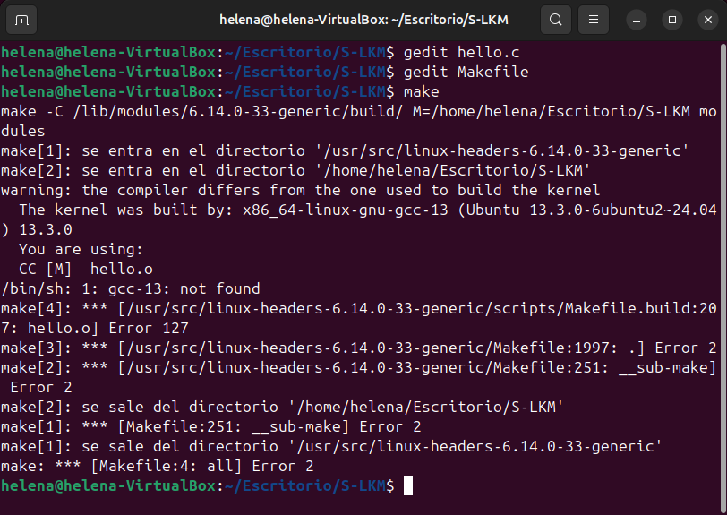
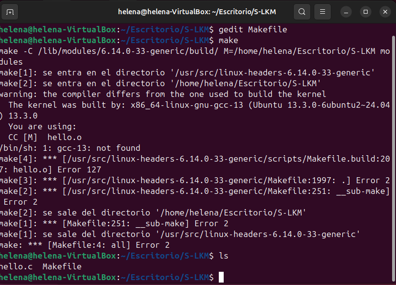
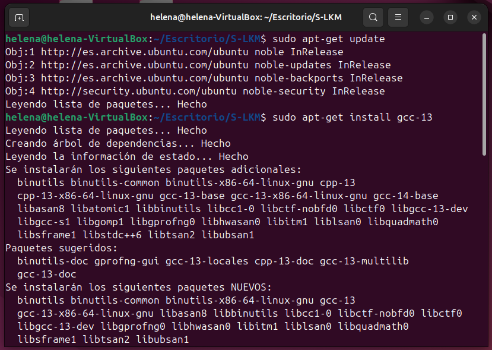
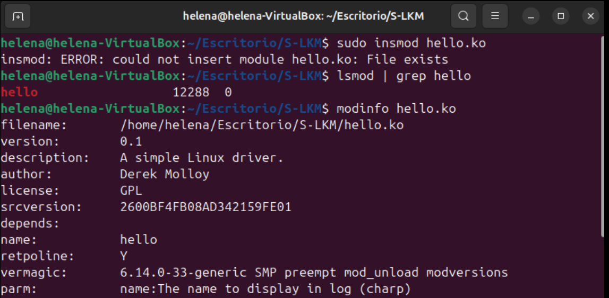
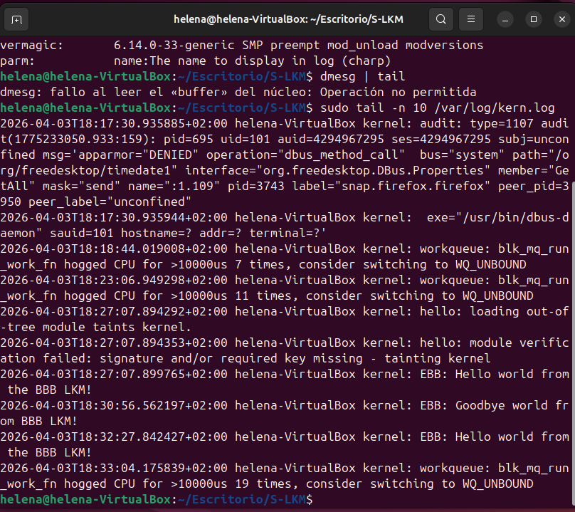

# Seminario - Módulos cargables del kernel (LKM)
---
El objetivo principal de este seminario es aprender el funicionamiento de los módulos LKM en un entorno Linux. Concretamente, he trabajado con Ubuntu. Para ello, se configurará el sistema operativo con las cabeceras adecuadas para construir, cargar y descargar módulos sencillos, verificando su correcta ejecución.			
	
Debido a la recomendación del profesor, la realización de este seminario se ha llevado a cabo en una máquina virtual Ubuntu 24.04 gestionada a través de VirtualBox. Esto es debido al riesgo que conlleva ejectar módulos LKM directamente en el espacio del kernel de nuestra máquina Linux, debido a los elevados privilegios. Aseguramos así un entorno de pruebas aislado y seguro sin poner en riesgo la integridad de nuestros datos personales.		

---

## Preparación del entorno
A la hora de desarrollar módulos cargables, es imprescindible que nuestro sistema operativo esté preparado para compilar el código del núcleo. Para ello, instalaremos cabeceras de Linux (linux-headers).		
* Actualizar los repositorios del sistema
```bash
sudo apt-get update		
```
<p align="center">
  
</p>


* Instalación de las cabeceras correspondientes
```bash
sudo apt-cache search linux-geaders-$(uname -r)		
```

```bash
sudo apt-get install linux-headers-$(uname -r)	
```			
<p align="center">
  
</p>


## Desarrollo del módulo
El módulo desarrollado [hello.c](hello.c) deriva de un código de ejemplo facilitado por "derekmolloy" en su propio repositorio. Este no posee una función main(), sino que se registra y atiende peticiones, permitiendo que el núcleo responda a eventos específicos. Se implementan funciones para la carga, descarga y limpieza del módulo, así como la comunición mediante logs (usando `printk()`). 		 

## Compilación
Para compilar el módulo del kernel, no utilizamos un compilador clásico de C. En su lugar, creamos un [Makefile](Makefile) que interactúe con el sistema.		 

<p align="center">
  
</p>

En mi caso, vemos el error `/bin/sh: 1: gcc-13: not found`. Este ocurre durante la compilación del módulo. Al no encontrar `gcc-13`, el proceso de compilación fallá con un `Error 127`, impidiendo la creación del los archivos intermedios y del módulo final `hello.ko`. Por lo tanto, en la siguiente imagen podemos ver como se solucionó mediante la instación de `gcc-13`. 
<p align="center">
  
  
</p>


* **Inserción del módulo.** Cargamos el archivo objeto en el espacio del núcleo. Requiere `sudo` al requerir un acceso al espacio del kernel. 

```bash
sudo insmod hello.ko		
```

* **Listar los módulos:** Con este comando verificamos que el paso anterior tuvo éxito, ya que con lsmod leemos el contenido del archivo del sistema, filtrando solo aquello que contenga la palabra `hello`. En la salida vemos que efectivamente el LKM estáa vivo y reside en la memoria. 
```bash
lsmod | grep hello		
```

* **Información del módulo.** Extraemos la información de las macros del código fuente, de manera que podemos examinar los metadatos del archivo antes o después de cargarlo.  
```bash
modinfo hello.ko	
```

La salida de este comando es extensa, en la que vemos campos clave como `filename`, dnde vemos la ruta del archivo .ko, `description` o `author` (Derek Molloy), entre otros. 

<p align="center">
  
</p>

* **Confirmar el funcionamiento.** Como los módulos del kernel no imprimen directamente los mensajes (por ejemplo usando un printf()), utilizan printk() para enviar información al registro del sistema. Por ello, usamos el siguiente comando para ver los mensajes que `helloBBB_init` y `helloBBB_exit` enviaron al log al usar `insmod` y `rmmmod`
```bash
sudo tail -n 10 /var/log/kern.log	
```

<p align="center">
  
</p>

Confirmamos con los mensajes siguientes, que nos demuestran el éxito:

```2026-04-03T18:27:007... **EBB: Hello world from the BBB LKM!**```
```2026-04-03T18:30:56... **EBB: Goodbye world from BBB LKM!**```
