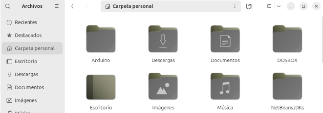
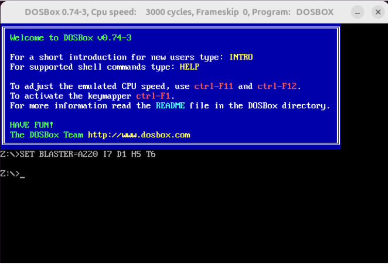
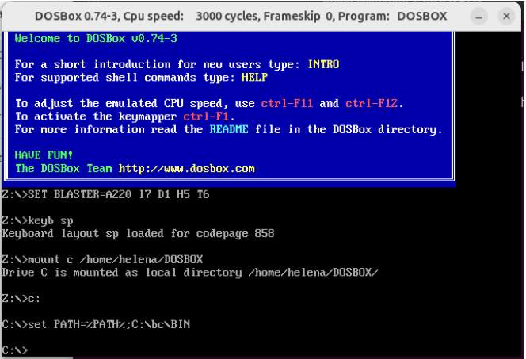
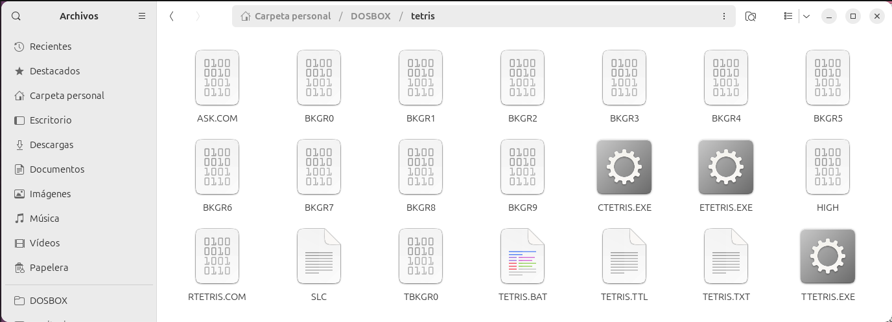
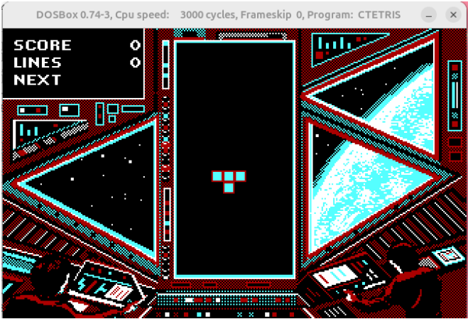
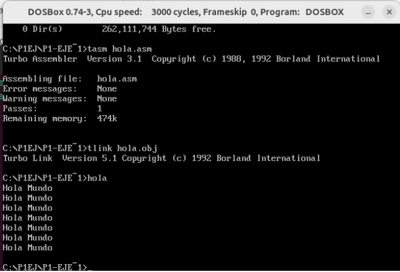

# Seminario 1 - Bajo Nivel

El primer paso es la creación de la estructura. Para ello se han seguido los siguientes pasos:
* **Estructura de directorios:** Se creó la carpeta `~/DOSBOX` en mi directorio personal de Ubuntu (/home/helena)    
     
* **Organización:** Se copiaron las carpetas `BC` (compilador) y `P1ej` (carpeta de ejemplo) dentro de la estructura. Se debe tener en cuenta que los nombres tengan un límite de 8 caracteres.    
      
* **Instalación del emulador:** Instalamos según el sistema operativo Linux, para lo que se usó el siguiente comando: 
```sudo apt install dosbox```
* **Configuración del entorno:** Debemos acceder con el comando ```dosbox``` al entorno.        
  )  

A continuación, debemos seguir varios pasos    
Para que dosbox reconozca nuestros archivos, debemos vincular la carpeta que tenemos albergada en el directorio home con el comando    
```mount c ~/DOSBOX```    
Configuramos el teclado con el comando `keyb sp`, activando la distribución e español. 
Debemos premitir que el sistema reconozca los comandos del compilador desde cualquier sitio, configurando el entorno Borland    
```set PATH=%PATH%;C:\BC\BIN```    
Este comando permite ejecutar el ensamblador y el enlazador desde cualquier ubicación.    
      
* **Pruebas:**
A continuación, para verificar que realmente el entorno es funcional, probaremos varios métodos.
    
**1. Ejecución de aplicaciones clasicas de MS-DOS**    
En este caso, he descargado una versión del juego clásico del Tetris de una plataforma online. La carpeta con todo el código fuente y ejecutables se ubica en la carpeta de nuestro directorio home. A continuación, para ejecutar el juego, escribimos  ```tetris ``` y lo ponemos a funcionar.    
  
  
    
**2. Uso del entorno Borland: diseño del programa ```hola.asm```** 
Este ejemplo imprime el mensaje "Hola Mundo" en bucle siete veces. Para ello, se crea el archivo fuente  [hola.asm](./ejemplos/hola.asm) y con la ayuda de  ```tasm hola.asm``` generamos el archivo objeto. Por otro lado  ```tslink hola.obj``` nos permite crear el ejecutable ```HOLA.EXE```. Por último, se ejecuta el programa y se verifica que la salida por pantalla muestra el mensaje indicado 7 veces exactas.    
  
